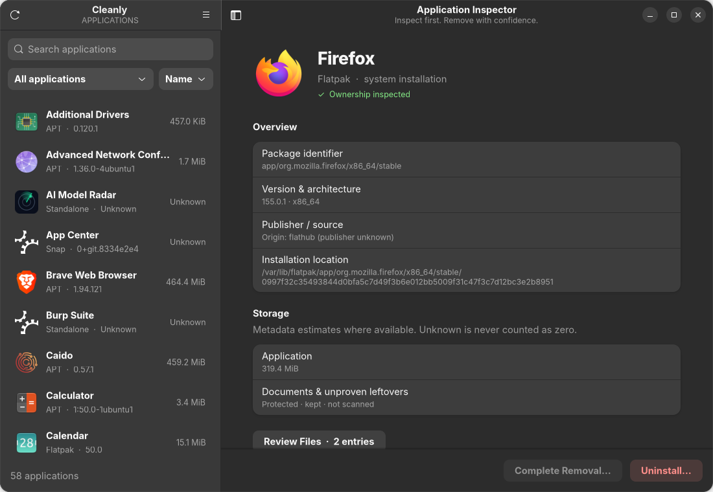

# Cleanly

A safe, native Linux app uninstaller built with **Rust, GTK4 and libadwaita**.

Cleanly shows how an application was installed, what belongs to it, and exactly what will be removed before making any changes.




## Features

- One-click uninstall with a full removal preview
- Shows app source, version, size and owned files
- Supports **APT/dpkg, Flatpak, Snap and AppImage**
- Protects shared files, dependencies and user documents
- Native GNOME light/dark UI
- Quarantine and restore for supported app data

## Install

### Ubuntu 26.04 — amd64

```bash
git clone https://github.com/SHADOWOKX/app-remover-linux.git
cd app-remover-linux
sudo apt install ./dist/cleanly_0.1.0_amd64.deb
```

Then open **Cleanly** from your applications menu, or run:

```bash
cleanly
```

> The included `.deb` was built and validated on Ubuntu 26.04.1.

## Build from source

Requires Rust 1.93+.

```bash
sudo apt install build-essential pkg-config libgtk-4-dev libadwaita-1-dev
cargo build --workspace --release --locked
sudo make install
cleanly
```

## Safety

If Cleanly cannot prove that a file belongs to the selected app, it keeps it. Shared dependencies, unrelated files and user documents are protected.

More details: [Security Review](docs/SECURITY-REVIEW.md) · [Validation](docs/VALIDATION.md)

## License

GPL-3.0-or-later. See [LICENSE](LICENSE).
